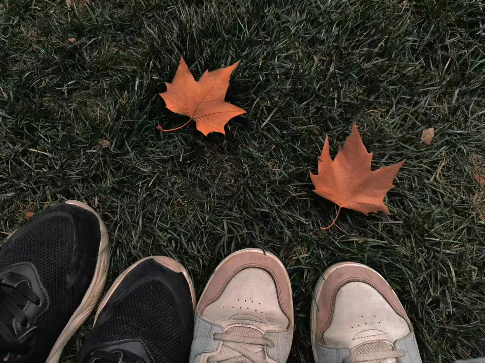
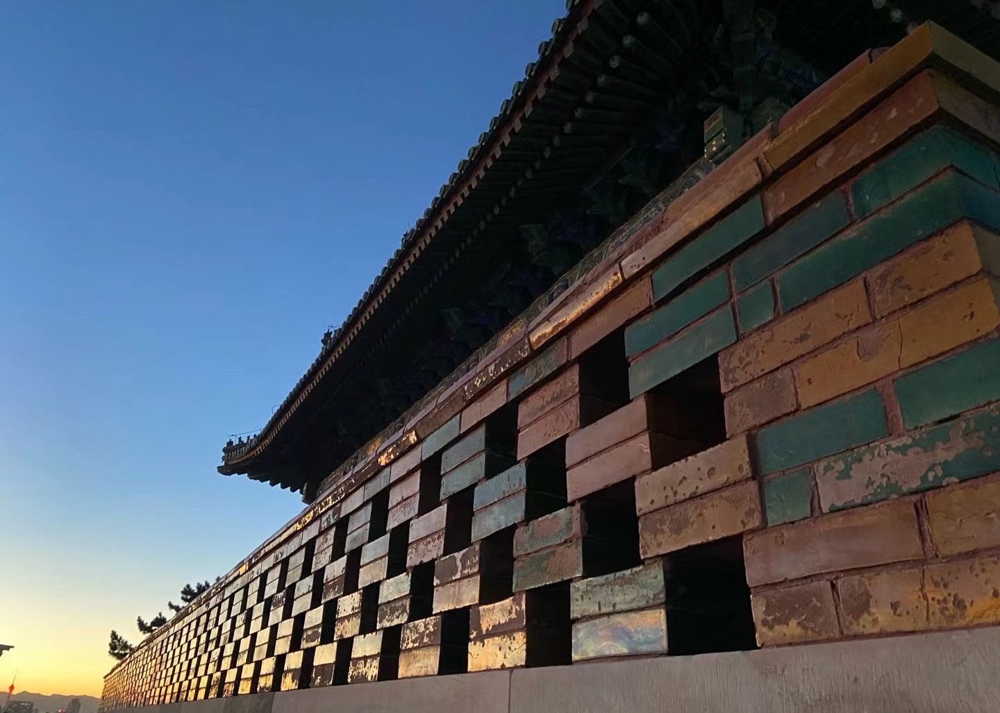

> 这是最好的时代，这是最坏的时代。

为一段旅程命名，竟然比行路本身更费心思。此行经上海至北京，但是似乎北京上海之旅是一个太普通的名字。忽然想到“北狩”：史书中帝王被俘的托辞，此刻却成了一个讽刺。所有命名都是精神的碑刻，为记忆赋形而已。于是从北京和上海各取了一个字，权且冠以“北上”。写完全篇才发现无心插柳的妙处：北上也是此行方向。对一个南方孩子来说，北上也是一条带着温度的河流，从厦门终年的暖雾里启程，奔涌向冰雪封疆的国度。

# 第一城：上海

> 这是光明的季节，这是黑暗的季节。

从十几度的厦门降落在接近零度的上海，对枯叶和冰雪这种“冬景”的期待被被刺骨的寒风击碎。一锅港式花雕鸡火锅成了救赎：黄酒的鲜香裹挟着热气翻涌，颠覆了我在香港两年的火锅记忆。或许这般滚烫的鲜美，本就需借几分寒气，才能激发出最好的味道。锅里的汤咕嘟咕嘟翻滚着，拥挤的馆子里热气开的十足，我和半年未见的朋友一边吃，一边聊，也不知过了多久，只觉得身心都暖和起来。

身子暖和了，自然要去街上走走。一月份的上海铺陈着深秋的景致，像我这样常年待在南方的人自然是瞬间被秋日的浪漫俘获：脚下沙沙作响的落叶，满目流淌的金黄，空气中浮动的扑面而来的凉意。但是没一会儿，冷风像针一样钻进衣领，冻得我受不了，只能狼狈地躲到街边小店取暖。就这么漫无目的地逛了半个下午，兴致彻底被冷风吹没了。或许我骨子里早就习惯南方的暖阳了，对北国秋冬的向往，不过一场纸上谈兵的幻想。

直到和朋友汇合，逛街才从在冷风中的挣扎变成了真正的城市探索。最舒服的是随心所欲的松弛：脚步随着目光自然而然地拐进一家家小店。逛逛堆满精巧小动物摆件的日式杂货铺，再看看挂着时髦冬装的时装店。当然也少不了去打卡全球最大的星巴克旗舰店。哪怕冻得够呛，我们还是任性地点了全冰沙的抹茶星冰乐！牙齿冻得直打颤，却笑得肆无忌惮，那点寒意，似乎也在这份放纵里被冲淡了。

> 我们面前拥有一切，我们面前一无所有。

我是彻头彻尾的J人，尤其是在旅行的时候：执着于安排好每一个旅行的瞬间和计划，最好是能在脑海中过一遍所有可能遇到的情况。而我的朋友，仿佛天生拥有在无数可能性中开辟新路的才能。我原本对这种计划外的事情总带着一丝谨慎的疑虑，可体验了几次随心而行、偏离航线后，我开始享受这种令人着迷的松弛滋味。

于是上海的这几天里，我们在人和馆尝到了心心念念的本帮菜；去了热门的景点和打卡地；也少不了骑车逛逛朋友的学校。我们也临时起意地去豫园看灯会；疯狂地在迪士尼看完烟花之后杀回项目玩到闭园广播响起，成为了最后两个离开园区的游客。

当然也有一些意料之外的惊吓：凌晨三点顶着睡意和寒意匆匆下楼，给朋友拿外卖送来的退烧药，这也算是另一种难忘的城市探索了。毕竟，这要是在香港，深更半夜的可没这么容易搞到药。

# 第二城：北京

飞往北京的那天恰逢我的生日。落地北京，我们一起去找阿包庆生：阿包比我小整整一岁，因此这也是她的18岁生日。

逛校园自然是必不可少的环节。我们在学校门口和阿包汇合，跟着她骑车在大学里闲逛。眼前豁然铺展开大片大片的绿茵草地，阳光慷慨地洒落，开阔的空间里自由生长着不知名的绿植，和叽叽喳喳的鸟雀。我心底不由得涌起一阵感慨：我那在方寸之间辗转腾挪的母校，何时也能拥有这样一片舒展的天地！

> 人们正在直登天堂；人们正在直下地狱。

北京给我的感觉，与上海截然不同。我最迷恋的北京街头巷尾的那股“烟火气”。这一点，竟和香港有着微妙的相似：那是某种蓬勃的、不加掩饰的生活热情。然而不同的是，北京的底色沉淀于古色古香的建筑之间，显得更为宽广醇厚。

故宫，便是这种磅礴气势的极致体现。红墙白雪，第一眼是美，是典雅，是庄重。但当穿过庄严的前殿步入后宫，那种空旷宏大的叙事转变成了层层叠叠的门与院。宫墙切割出的方寸天空，让我瞬间体味到“一入宫门深似海”的况味。此刻，才恍然懂得“庭院深深”那个“深”字的份量：它远不止于空间的幽闭，更是一种在时间长河中不断累积、固化的结构性制度带给人的无法喘息的压抑。

行走在漫长的宫墙下，我感受到一种奇特的共鸣：封建王朝的绝对权威早已成为历史，留下的，更像是一件件承载着民族智慧与审美精髓的文化遗产。这些红墙、院落、亭台楼阁，本身无疑是极美的。但它们的意义远不止于中华的美学与文化符号。我也清晰地感受到了一种跨越时空的普遍性：无论时代如何变迁，欲望催生结构，结构异化个体，权力滋生孤独。这些人类个体在宏大结构中的挣扎和困境，仿佛在这些沉默的建筑里留下了永恒的回响。

> 死而复生

旅程的终点，是景山顶上看到的日落。上山的时候，我满心都是没看到雪，只被马路上的冰渣子滑了一跤的遗憾。走到一个亭子，风景不错，能望尽紫禁城，发现这是崇祯皇帝自缢的地方。他在最后时刻想了什么，无人知晓。不过，我们总算没错过北京的日落。我们就望着这座城，看着太阳沉下去。

日落，就是明天的开始。明天又是新的一天！

