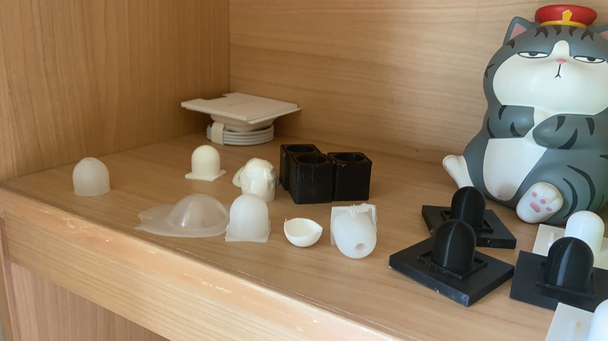

# Inspiration

The whole project
[^1] is based on the following idea: Sorting a pile of laundry is simple for humans, but challenging for robots.

The main issue here is that fabric is elusive. When a human touches a shirt, we rely on subtle tactile feedback to know exactly where the surface is. The fingers can feel the slightest graze of a fabric surface without disturbing the pile. Robots, on the other hand, usually struggle with this. Most robotic grippers are rigid. When a rigid sensor touches a soft, fluffy sweater, the sweater deforms and compresses long before the sensor registers any force.

> Why is this "squashing" a problem?

It comes down to singulation: the ability to pick up just one item. Imagine a stack of t-shirts. If a robot has to press down to "feel" the contact, it compresses the top shirt into the ones below. This pressure increases friction and causes the fabric layers to stick together. So instead of peeling off a single layer, the robot inevitably grabs a clump of multiple items.

The takaway message is: **the robot must detect the surface before compressing the pile**.

# Intuitive Idea

One way to achieve this is by pushing hardware limits: using sensors with extremely high spatial resolution and ultra-low latency. However, in an industrial context, building a sensor that is fast, accurate, robust, and affordable is a massive engineering challenge.

So, consider flipping the condition: If the sensor is designed to be softer than the fabric, the sensor will deform before the fabric does. This mechanical compliance acts as a buffer, giving the system more time to detect the contact event while ensuring the interaction force remains minimal.

> How to sense force in a piece of soft surface?

This leads to a another intuitive realization: in a soft body, geometric deformation is easier to observe than contact force. So instead of trying to embed complex pressure arrays (which often make the skin stiffer) or measure electrical resistance (which can be noisy), just monitor the shape of the sensor from the inside.

The final design follows this logic directly:

1. The Interface: A soft silicone membrane that deforms instantly upon contact.
2. The Observer: An internal Time-of-Flight (ToF) optical sensor that continuously measures the distance to the center of the membrane.

When the membrane touches a fabric, it gets pushed inward. The optical sensor detects this tiny reduction in distance, effectively translating a physical deformation into a precise contact signal.

# Design & Fabrication

For the hardware, the electronics are actually the easy part. The core is a standard Time-of-Flight (ToF) module. It has a relatively wide field of view (FoV) and high spatial resolution, which is perfect for short-range detection.

The true puzzle is the soft surface itself. It must be softer than the fabric to prevent compression, yet stiff enough to hold its shape against gravity, motion, or air currents. The fun part of engineering is trying things until they work. After iterating through several designs, I found that a 0.4 mm‑thick silicone gel membrane was the winner. When formed into a hemispherical shape, it was the softest configuration that could still maintain its shape stability.

A tip for fabricating a soft membrane is to design a proper fixing structure for the 3D mold that holds the mold securely in place. This helps ensure that the membrane maintains a uniform thickness in all directions.

# Algorithm & Testing

The signal processing is straightforward. I used a standard Kalman Filter to clean the raw sensor data. The logic is simple: a decrease in distance indicates that contact has occurred. The real challenge lies in balancing **accuracy** and **sensitivity**.

If we simply lower the detection threshold to be more sensitive, the robot starts reacting to the wind (false positives). If we raise the threshold to be more accurate, the robot reacts too late, and the fabric gets squashed. We couldn't solve this trade-off just by tuning software parameters. We needed a better physical indicator.

Instead of just looking at "how much" the distance changed, I started looking at "how" the membrane deformed. I discovered a non-linear physical behavior that distinguishes real contact from noise. By training the classifier to recognize this specific deformation pattern rather than just a simple distance threshold, we achieved high sensitivity without the false alarms.

[^1]: The official paper, [A Highly Robust Contact Sensor for Precise Contact Detection of Fabric](https://ieeexplore.ieee.org/stamp/stamp.jsp?tp=&arnumber=11127921), has been published on ICRA 2025.
