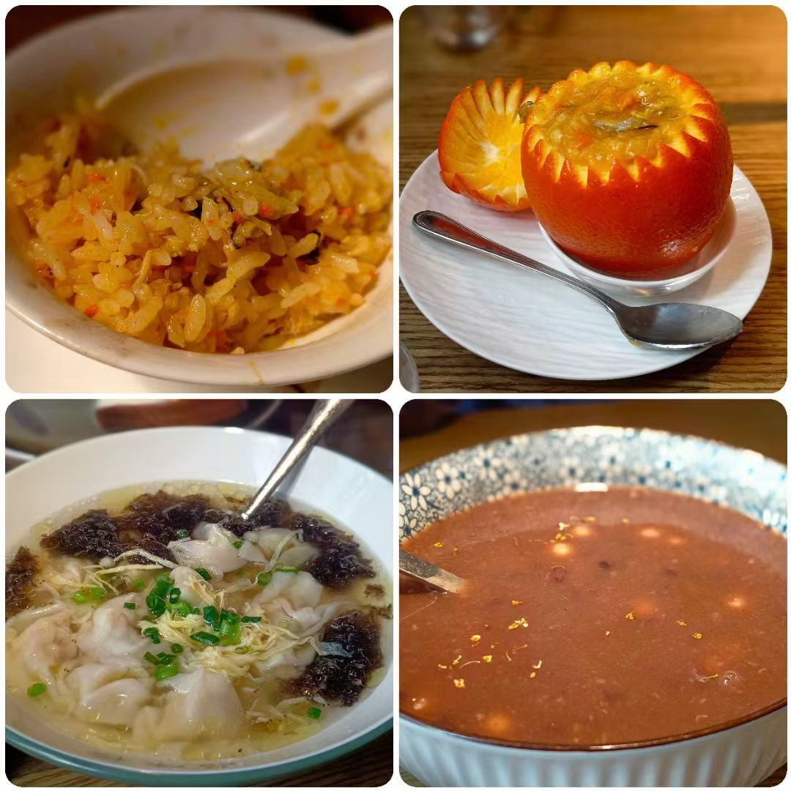
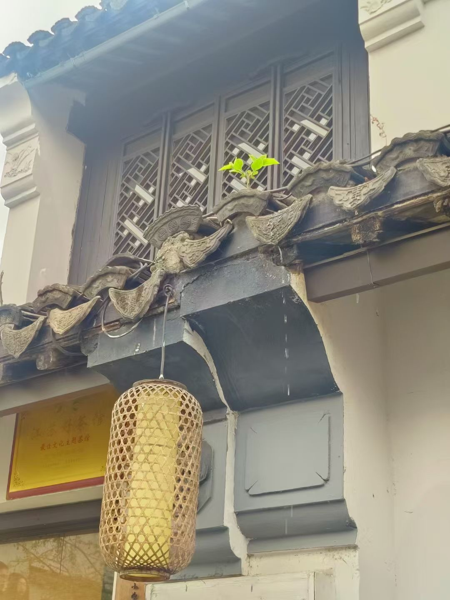
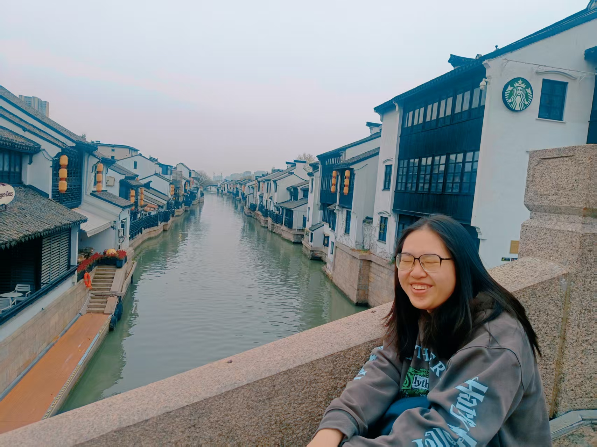

期中考一结束，某J人便决定逃离香港这个没有四季的地方，去赴一场春天的约会。很幸运拥有一个说走就走的P人朋友，于是迅速决定了清明的无锡赏樱之行。

下飞机的第一感受是...冷冷冷冷冷。香港早已是短袖的季节，我想着四月的无锡也该回暖了，只带了一件外套。谁知凛风扑面，春天仿佛仍在迟疑不前。想到了苏东坡那句，料峭春寒吹酒醒，这大概就是江南早春的标配吧。

另一个标配，大概就是美食：一口热气腾腾的美食，可以让人瞬间回暖，心满意足地开始踏青的旅程。以前听说无锡的口味偏甜，但第一顿吃起来还是挺新鲜的。像蟹酿橙这种带点甜味的菜，用甜来衬托鲜，中和些许涩意，倒也别有滋味。（最后一天更新：甜的确实有点过分热情了。有些本不该是甜口的菜，比如酱排骨，也是甜的，有点腻。于是果断改投淮扬菜的怀抱了。）

我们原本最期待的是江南名菜腌笃鲜，就是拿腌肉、咸肉、火腿和鲜嫩的春笋一起小火慢炖、焖煮。可是吃了两家好评如潮的腌笃鲜之后，我们有点怀疑福建两广以北的人是不是平时不喝靓汤：汤里的鲜笋和咸肉的味道像是各过各的，确实各有鲜味，却没有融合起来，而是咸味压过了鲜，而鲜笋微微的酸又压过了烟熏的风味。但是话说回来，可能闽粤菜里的汤对其他地方的人来说就是清汤寡水，食之无味吧。

在铺着青石板路的老街上漫无目的地逛着，不知不觉就走进了春天里。无锡的一切好像都是为春天准备的。转个角，就能遇到一小片花园，河道里映着花和小楼的影子。白墙青砖，石缝和墙缝里的新芽与花朵，在阳光下悄悄伸展，像是大自然给水墨画上添些色彩。人（也可能是我）总是能被这种充满生命力的画面所感染。

我特别喜欢这个场景：走在桥上，静谧的河道与两岸的建筑向无尽延伸，好像是误入了一场古时候的梦境，而星巴克和哈根达斯的标志就好像盗梦空间里的锚点。这一幕有一种强烈的戏剧感，就好像梦和现实在同一帧重叠。

江南的春景并不是一味地绿，或者一味地红，而是层层铺陈、错落有致，一步换一景，因此就不会觉得腻。反倒是香港，绿地虽然多，青山、树林都不少，但徒步几十分钟，眼前的景色仍然是同样的一大片绿色，就显得单调了。记得之前语文课学的中式园林的美学，说美是第一要义，而意趣才是其灵魂。什么时候该曲径通幽，什么时候又要豁然开朗，都有讲究。我不了解怎么布局和规划，但在随意走动之间，就能感受到主人处处暗藏的巧思，和他独特的意趣与审美。

由于前一天被无锡的园林所吸引，我们临时决定（是挺P的）坐高铁去苏州玩一天，看看中国园林巅峰之作是什么样的。如果说无锡的园林里，建筑更多是用来看景的；到了苏州，倒像什么都是景，拱门、石桥、亭台楼阁，还有点缀其中的游人，全都成了画里的一部分。

四月份的无锡是世界最好的赏樱地之一。从蠡园坐船去鼋头渚，湖光、山色一路铺开。群鸟在船尾盘旋，当然不是为了和我们共赴赏樱，是有船员在给他们扔吃的。

当地人说，樱花每年只开这几天，一场雨就会落下一大片。我想起曾经读到过的“物哀”的审美，好像也是以樱花为喻：美是流动的、易逝的，却总能自然地触动人心。或许短暂就是意义本身：因为稍纵即逝，所以珍贵，能在心里停留更久。或许一个人短暂的生命也可以像这样，以不同方式被记起，从而不朽。
